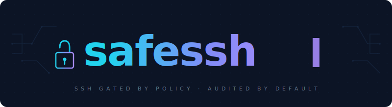
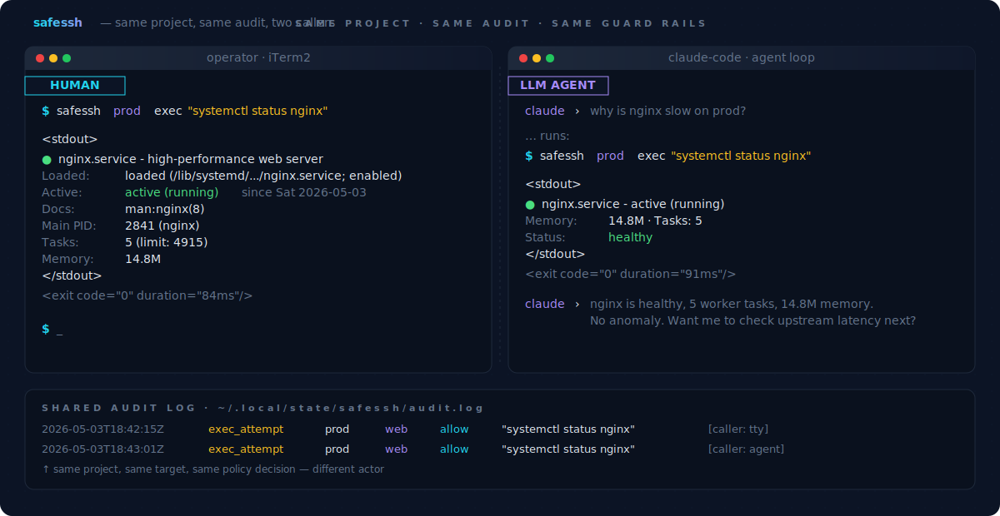
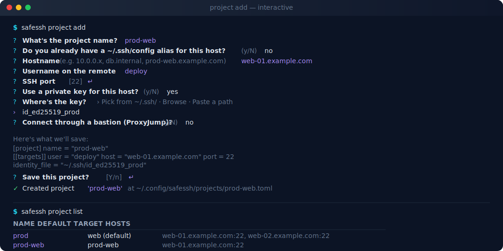
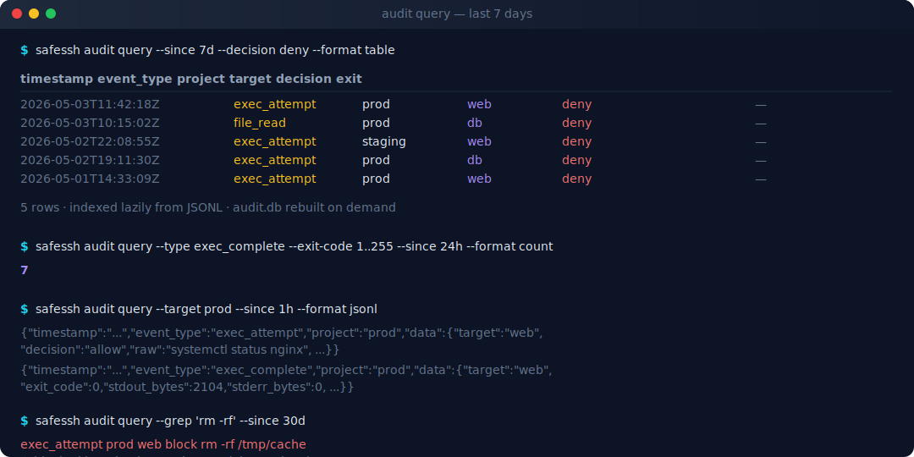
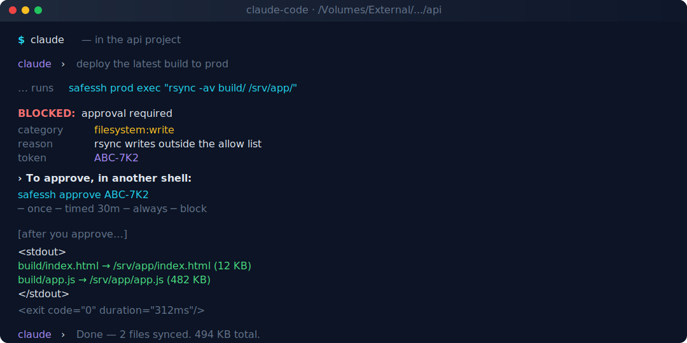
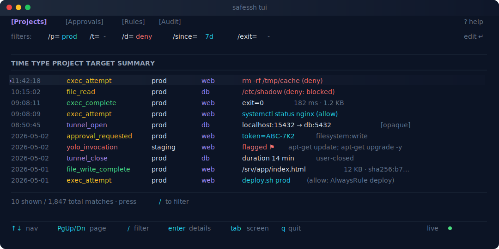

<p align="center">
  
</p>

<p align="center">
  <strong>Safe remote-server access for humans and LLMs.</strong>
</p>

<p align="center">
  
  
  
  
</p>

<p align="center">
  Stop juggling keys, IPs, and bastions across a dozen servers. Save each as a project,
  run commands by name, and get every action in a queryable audit log.
  Hand a project to an LLM agent and the credentials never leave your machine.
</p>

<p align="center">
  
</p>

---

## Servers as named projects

Tracking eleven server identities across SSH config, password managers, and scattered notes is unmanageable in practice. `safessh` collapses each connection into a single named project — `prod`, `staging`, `db-replica` — sourced from an existing `~/.ssh/config` Host block or from a one-time interactive setup. Subsequent commands address the project by name:

```sh
safessh prod exec "systemctl status nginx"
safessh app --on web exec "tail -n 100 /var/log/access.log"
```

Multi-target projects allow several hosts under one logical name; the active target is selected per-call with `--on <name>`.

<p align="center">
  
</p>

---

## Audit by default

Every gating event lands in an append-only JSONL log **before** any user-visible output. A lazy SQLite index makes the log queryable in milliseconds; if the index ever breaks, queries fall back to a raw log scan and the JSONL remains untouched. Filter by project, target, decision, exit code, and time window:

```sh
safessh audit query --since 7d --decision deny --format table
safessh audit query --type exec_complete --exit-code 1..255 --format count
safessh audit query --target prod --grep "rm -rf"
```

<p align="center">
  
</p>

---

## Approve before it runs

Read-only commands are allowed by default. Anything that mutates — `rsync`, `apt-get install`, redirected output — pauses for explicit approval. The proxy emits a structured `BLOCKED:` block to stdout containing the parsed command, matched policy categories, and a one-time approval token:

```
BLOCKED: approval required
  category   filesystem:write
  reason     rsync writes outside the allow list
  token      ABC-7K2
```

A separate invocation releases the command:

```sh
safessh approve ABC-7K2              # one-shot
safessh approve ABC-7K2 --timed 30   # next 30 minutes
safessh approve ABC-7K2 --always     # persistent rule
safessh approve ABC-7K2 --block      # permanent deny
```

<p align="center">
  
</p>

---

## Review with the TUI

`safessh tui` opens a four-screen review tool — projects, approvals, rules, audit — with a live filesystem watcher. Edit a `.toml` policy in your editor and the TUI reflects it on the next paint. The audit screen is backed by the SQLite index, so it's not capped at the last N events; filter the same way you would on the command line.

<p align="center">
  
</p>

---

## Safe to hand to an LLM

Granting an LLM agent unrestricted SSH carries significant operational risk: arbitrary command execution against production hosts with no review surface. `safessh` reduces that surface to a fixed CLI vocabulary — `safessh <project> exec`, `read`, `write`, `forward` — without exposing the underlying credentials, hostnames, or ports. Every invocation passes through the same policy gate and the same audit trail as a human-issued command. A representative agent loop:

```
claude  ›  deploy the latest build to prod
        ↓
        safessh prod exec "rsync -av build/ /srv/app/"
        ↓
        BLOCKED: filesystem:write — token ABC-7K2
        ↓
        (operator) safessh approve ABC-7K2 --once
        ↓
        <stdout>... 2 files synced ...</stdout>
        <exit code="0" duration="312ms"/>
```

The agent receives a predictable, parsable interface. The operator keeps the keys, the policy, and the audit.

Six adapters ship the agent skill verbatim — pick one or fan out:

```sh
safessh skill install --target claude-code --scope user
safessh skill install --target all --scope user      # claude-code, gemini-cli, codex
safessh skill install --target all --scope project   # claude-code, agents-md, cursor, gemini-cli
safessh skill update --dry-run                       # show what update would change
safessh skill detect --format json                   # script-friendly install report
```

---

## Quick start

```sh
# Install — macOS or Linux
brew install sanif/tap/safessh
# or:
curl --proto '=https' --tlsv1.2 -fsSL \
  https://github.com/sanif/safessh/releases/latest/download/safessh-cli-installer.sh | sh

# 1. Add a project — interactive prompts walk you through name, target,
#    SSH alias / inline host, and key picker.
safessh project add

# 2. Install the skill so your LLM agent knows the workflow.
safessh skill install --target claude-code --scope user

# 3. Run a command. Read-only stuff is allowed by default.
safessh prod exec "systemctl status nginx"

# 4. Review what happened.
safessh audit query --since 24h --decision deny --format table
safessh tui
```

Prefer to script it? Skip the prompts:

```sh
safessh project add prod --alias my-prod-host
safessh project add staging --host stg.internal --user deploy --port 2222
safessh project add prod-imported --import-ssh-config my-prod-host
```

---

## Features

| | Feature | Description |
|---|---|---|
| **Projects** | Servers as named projects | Each connection saved as `prod`, `staging`, `db-replica` — addressable by name |
| **Projects** | Multi-target | One project, many hosts; per-call `--on <target>` |
| **Projects** | ssh-config import | `--import-ssh-config <alias>` materializes user/host/port/key in one shot |
| **Projects** | Interactive add/edit | `safessh project add` / `project edit` walk through prompts; rustyline-backed text editing |
| **Audit** | JSONL append-only | Authoritative log; rotates at 100 MiB; redaction always on |
| **Audit** | Lazy SQLite index | Built on demand from JSONL; rebuildable with `rm audit.db` |
| **Audit** | Structured query | `--since/--until/--decision/--exit-code/--target/--limit/--format` |
| **Audit** | Live TUI screen | Filter, paginate, no event cap (SQLite-backed) |
| **Policy** | Categories + AST | `read:safe`, `read:state`, `filesystem:write`, `network:tunnel`, … |
| **Policy** | Per-call approvals | One-shot, timed (N min), always (pattern), block (deny + log) |
| **Policy** | File rules | Path-glob allow/approve/deny/block per category |
| **Policy** | `--yolo` bypass | Audited as `yolo_invocation`; killable globally via `disable_yolo` |
| **Skill** | Six adapters | claude-code · agents-md · cursor · gemini-cli · codex · plain |
| **Skill** | `skill install --target all` | Walks the supported (target, scope) matrix |
| **Skill** | `skill update [--dry-run]` | Re-renders the embedded body and rewrites every installed copy |
| **Skill** | `skill detect` | Per-target install status (`current`, `drift`, `not detected`, …) |
| **Exec** | `<project> exec "<cmd>"` | AST-parsed, policy-gated SSH command |
| **Exec** | `<project> read <path>` / `write <path>` | File operations with path-glob rules + size caps |
| **Exec** | `<project> forward L:H:R` | Port forwarding with TTL + opaque-tunnel audit |
| **TUI** | Four screens | Projects · Approvals · Rules · Audit |
| **TUI** | Live filesystem watcher | External edits to project / rule TOML reflect on next paint |
| **TUI** | Inline add/edit | `a` add, `e` edit, `i` import on the projects screen |
| **Ops** | Atomic file writes | Every config / state mutation goes through `tempfile + persist` |
| **Ops** | No outbound network | Skill content embedded; no telemetry; no auto-update |
| **Ops** | Conventional Commits + cargo-dist | Tag → cross-compiled binaries + Homebrew tap update |

---

## How it fits in your agent loop

1. The agent runs `safessh prod exec "rsync -av build/ /srv/app/"`.
2. `safessh-policy` parses the command into an AST and checks it against the project's allow list, persistent rules, and category catalogue.
3. **Allow** → `safessh-ssh` shells out via `ssh` (or `sftp` / `ssh -L` for read/write/forward) using a `ControlMaster` socket so subsequent calls reuse the connection.
4. **RequireApproval** → a `BLOCKED:` token block is printed to stdout for the agent to parse, and a `PendingRequest` is persisted. Approve in another shell with `safessh approve <token>` (once / timed / always / block) or via the TUI.
5. **Deny / Block** → exit non-zero immediately with a clear category and reason.
6. **Every step** writes a JSONL audit row before any user-visible output.

The agent never sees the SSH layer. The operator sees everything via `audit query` or the TUI.

---

## Commands

| Command | Description |
|---|---|
| `safessh <project> exec "<cmd>"` | Run a gated command |
| `safessh <project> read <path>` | Read a remote file (size-capped, audited) |
| `safessh <project> write <path>` | Write a remote file (categorized, audited) |
| `safessh <project> forward L:H:R` | Open a port forward (TTL'd, opaque) |
| `safessh project {add,edit,list,remove}` | Manage projects (interactive when args omitted) |
| `safessh policy show <project>` | Print resolved policy for a project |
| `safessh approve <token> [--timed N \| --always \| --block]` | Resolve a pending approval |
| `safessh audit query [--since ...] [--decision ...] [--format ...]` | Structured audit query |
| `safessh tui` | Launch the review TUI |
| `safessh skill {install,uninstall,update,detect,show,check}` | Manage agent skill files |
| `safessh tunnels {list,close}` | Manage open port forwards |

See [`docs/cli-reference.md`](docs/cli-reference.md) for every flag and exit code.

---

## Agent integration

| Target | Install paths | Format |
|---|---|---|
| `claude-code` | `~/.claude/skills/safessh.md` (user) · `<cwd>/.claude/skills/safessh.md` (project) | YAML frontmatter |
| `agents-md` | `<cwd>/AGENTS.md` (project) | `## safessh` section |
| `cursor` | `<cwd>/.cursor/rules/safessh.md` (project) | Cursor frontmatter |
| `gemini-cli` | `~/.gemini/GEMINI.md` (user) · `<cwd>/GEMINI.md` (project) | `## safessh` section |
| `codex` | `~/.codex/AGENTS.md` (user) | `## safessh` section |
| `plain` | caller-supplied via `--path` | verbatim body |

---

## Documentation

| Document | Description |
|---|---|
| **[Getting started](docs/getting-started.md)** | First-run walkthrough |
| **[CLI reference](docs/cli-reference.md)** | Every subcommand, flag, exit code |
| **[Projects](docs/projects.md)** | Project model, multi-target, ssh-config import |
| **[Policy](docs/policy.md)** | Categories, AST matching, file rules |
| **[Approvals](docs/approvals.md)** | Approval lifecycle, persistent rule stores |
| **[Audit](docs/audit.md)** | JSONL schema, SQLite index, query recipes, recovery |
| **[TUI](docs/tui.md)** | Screens, keymap, live filesystem watcher |
| **[Files](docs/files.md)** | File read/write, path-globs, safety invariants |
| **[Tunnels](docs/tunnels.md)** | Port forwarding, TTL, opacity, `network:tunnel` policy |
| **[Skill](docs/skill.md)** | Multi-agent skill installation, update flow, detection |
| **[Security](docs/security.md)** | Threat model and the twelve safety invariants |
| **[Development](docs/development.md)** | Workspace layout, build, contributing |

---

## Requirements

- **macOS** or **Linux** · **Rust 1.75+** to build from source · **OpenSSH** (`ssh`, `sftp`, `ssh-agent`) on the host.
- The `rusqlite` `bundled` feature compiles SQLite from source — needs a C compiler, which all major dev environments and CI containers ship with.

---

## License

Dual-licensed under [MIT](LICENSE-MIT) or [Apache-2.0](LICENSE-APACHE), at your option.
